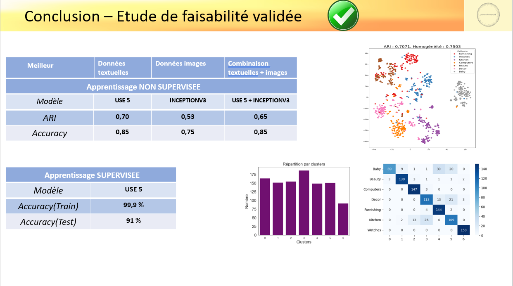

# Classification Automatique des Biens de Consommation

## Description du Projet
Ce projet a pour objectif de classifier automatiquement différents types de produits de consommation à l'aide de techniques avancées de traitement du langage naturel (NLP) et de traitement d'images. Les données proviennent de descriptions textuelles et d'images des produits. L'approche adoptée combine l'utilisation de modèles NLP et des algorithmes de vision par ordinateur pour obtenir des résultats optimaux.

## Structure des Données

### 1. Données Textuelles
Les descriptions des produits fournissent des informations clés qui sont utilisées pour la classification. La **Fréquence des mots** dans ces descriptions est une étape importante pour identifier les termes les plus communs et comprendre la structure textuelle des données.

#### Illustration : Fréquence des Mots

- Le graphique montre les **20 mots les plus fréquents** dans les descriptions et les noms de produits.
- Des nuages de mots sont également générés pour différentes catégories de produits (fournitures, bébé, montre, décoration, cuisine, beauté, informatique).

### 2. Données d'Images
En complément des descriptions textuelles, des images des produits sont analysées. Les caractéristiques visuelles sont extraites à l'aide des algorithmes **SIFT** et **ORB** pour détecter les points clés.

#### Illustration : SIFT et ORB Visual Words

- Les points clés des images sont détectés grâce aux algorithmes **SIFT** et **ORB**.
- Les histogrammes permettent de visualiser la fréquence des mots visuels dans les images de produits comme les montres.

## Approche Méthodologique

### 1. Apprentissage Non Supervisé
Pour la phase d'apprentissage non supervisé, nous avons utilisé une combinaison des données textuelles et d'images pour effectuer un clustering des produits. Les modèles **USE 5** (pour les textes) et **Inception V3** (pour les images) ont été utilisés. 

#### Illustration : Combinaison de USE 5 et Inception V3

- Le clustering montre une séparation des différentes catégories de produits sur la base des descriptions textuelles et des images.
- Les performances sont mesurées par des indicateurs tels que l'indice de Rand ajusté (ARI) et la précision.

### 2. Apprentissage Supervisé
Une fois le modèle initial validé, l'étape suivante a consisté à entraîner un modèle supervisé sur les mêmes données. Les performances du modèle sont évaluées avec des métriques de précision à la fois sur l'ensemble d'entraînement et l'ensemble de test.

#### Illustration : Résultats de la Méthodologie

- L'approche supervisée a atteint une précision de **99,9%** sur l'ensemble d'entraînement et de **91%** sur l'ensemble de test.
- Le tableau récapitulatif montre les performances des modèles pour l'apprentissage non supervisé et supervisé.

## Conclusion
L'étude de faisabilité a montré que la combinaison des données textuelles et visuelles permet d'améliorer significativement les performances des modèles de classification des produits de consommation. Cette approche peut être généralisée pour d'autres types de produits et d'industries.
